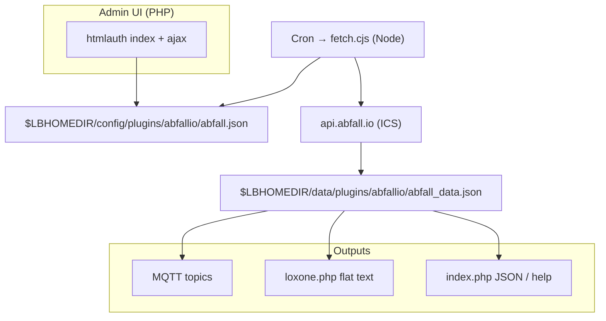
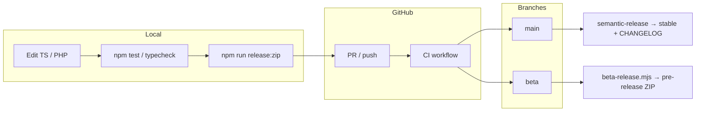

# loxberry-api-abfall-io

<p align="center">
  
</p>

[](https://github.com/spid3r/loxberry-api-abfall-io/actions/workflows/ci.yml)
[](https://github.com/spid3r/loxberry-api-abfall-io/actions/workflows/release.yml)

LoxBerry 3 plugin that retrieves waste-collection schedules from
[`api.abfall.io`](https://api.abfall.io/) and exposes them as JSON, flat-text
(Loxone) and MQTT topics.

**Disclaimer (read this):** This project is **not** official,
**not** endorsed by the api.abfall.io / AbfallPlus operators, and **there is no support obligation** from them or from
the maintainers. It is a **community best-effort** tool using **publicly accessible** HTTP usage, with a **minimum
6-hour** interval between scheduled fetches to avoid placing unnecessary load on upstream servers. The service may
**change or stop at any time**. Full text: **[DISCLAIMER.md](./DISCLAIMER.md)** (German and English).

## Table of contents

- [Features](#features)
- [Data source](#data-source)
- [Supported regions in the UI](#supported-regions-in-the-ui)
- [Public help page](#public-help-page-and-languages)
- [Installation](#installation)
- [Configuration](#configuration)
- [JSON format](#json-format)
- [Architecture](#architecture)
- [Building & development](#building--development)
- [Runtime compatibility](#runtime-compatibility)
- [Best-practice alignment](#best-practice-alignment)
- [License](#license)

## Features

- **Admin UI in German and English** — language from **Language** dropdown, `?lang=de` / `?lang=en`, cookie, plugin config, LoxBerry system language, `Accept-Language`; default **German**. **Status** tab includes a short “how to use” block. Page is **embedded in the LoxBerry shell** like other plugins.
- Street and house-number lookup against `api.abfall.io`.
- **Cron** (hourly at minute 17): `fetch.cjs` respects a **minimum interval** (default **6 h**, up to 168 h) plus **fuzz** (default ±30 min) so many boxes do not hit the API at the same instant.
- **JSON** via admin/ajax; optional **JSON snapshot** from `plugins/.../index.php?format=json`; Loxone **flat text** from `webfrontend/html/loxone.php`.
- **Icons:** `icons/icon_*.png` (labelled) → `/system/images/icons/abfallio/`; admin header uses `webfrontend/htmlauth/icon_64.png` (glyph from `icon_source_without_text.svg`). `ICON=icon_64.png` in `plugin.cfg`.
- Optional **category filter** and **MQTT** (LoxBerry broker auto-detect from `general.json`, topic prefix, retain, QoS 1).

## Data source

Single data path: public [`api.abfall.io`](https://api.abfall.io/). The **Data source** line in the UI is **informational**, not a selector. Schedules are fetched as **ICS** in the background and normalised — no manual ICS files. **No personal account** on api.abfall.io. Each provider has a **32-character hex service key** (same as on municipal “Abfuhrtermine” pages). **Location** tab: pick region or expert key → **Save region & settings**; then street search. Until a key is saved, street search and fetch are disabled. Finding the key: browser **Network** tab on ICS export, or community docs (e.g. Home Assistant [abfall.io source](https://github.com/mampfes/hacs_waste_collection_schedule/blob/master/doc/source/abfall_io.md)).

## Supported regions in the UI

Only schedules reachable via **api.abfall.io**. The **Location** tab lists supported regions in the collapsible *“Which regions work?”* block (names from the bundled autocomplete data).

- **Source:** community list aligned with Home Assistant [`waste_collection_schedule`](https://github.com/mampfes/hacs_waste_collection_schedule) / *AbfallIO* `SERVICE_MAP`; plugin can **refresh online** (`AbfallIO.py`).
- **Bundled:** `data/abfallio-service-map.json` (in the ZIP).
- **Override:** `<LBHOMEDIR>/data/plugins/<FOLDER>/abfallio-service-map.json` if present.
- **Town missing?** Try expert **service key**; operators **not** on abfall.io are out of scope.

## Public help page and languages

Opening `plugins/<folder>/index.php` shows a **short help** page (`?view=html`). Same strings as admin live in `templates/lang/language_*.ini`. For machines: `?format=json` as below. `?lang=de` / `?lang=en` switch language.

## Installation

### On a LoxBerry appliance

1. Download the latest plugin ZIP from [GitHub Releases](https://github.com/spid3r/loxberry-api-abfall-io/releases).
2. **System → Plugins** → install.
3. Open plugin → **Location**: region (or service key) → **Save region & settings** → street → save → **Status** → **Fetch now**.

**Beginner path:** (1) Location + save. (2) Street + save. (3) Status → Fetch now. (4) Optional: **Settings** (interval ≥6 h, filter, MQTT, Loxone/JSON). Problems → **Log** tab. See [DISCLAIMER.md](./DISCLAIMER.md).

**Install from URL:** use the **release asset** ZIP link (`…/releases/download/vVERSION/loxberry-plugin-abfallio-VERSION.zip`), not “Source code”. More detail: [docs/DEVELOPER.md](./docs/DEVELOPER.md).

**Install errors (extract / “Unknown Plugin”):** [docs/troubleshooting-plugin-install.md](./docs/troubleshooting-plugin-install.md).

### Local development

Clone, `npm install`, `npm run typecheck`, `npm test`, `npm run build`. Full gate: `npm run test:all`. **Contributors:** full workflow (live deploy, E2E, semantic-release, beta lane) → **[docs/DEVELOPER.md](./docs/DEVELOPER.md)**.

## Configuration

### 1) Location (region, then address)

In the *Standort* / *Location* tab:

- Choose **waste region** (autocomplete) or expert **service key**, then **Save region & settings**
- **Then** search a street (min. 3 characters)
- Pick a house number if required
- **Save location**

### 2) Fetch interval & fuzz factor

In *Einstellungen* / *Settings*:

- **Fetch interval (hours)** — default **6** (UI or local `config/abfall.json` in a git checkout). Release ZIP **does not** ship `config/abfall.json` so upgrades do not overwrite `$LBHOMEDIR/config/plugins/abfallio/abfall.json`. LoxBerry **rebuilds plugin trees on upgrade**; **`preupgrade.sh` / `postupgrade.sh`** back up and restore `config/plugins/...` and `data/plugins/...`.
- **Fuzz (± minutes)** — default ±30; set `0` to disable.

Cron runs hourly at :17; `fetch.cjs` skips until interval + fuzz allow the next run.

### 3) MQTT publishing (optional)

Toggle publish-after-fetch; auto-detect LoxBerry broker or set host/port/user. After each successful fetch (retained, QoS 1), topics include:

```text
<prefix>/state
<prefix>/last_fetch
<prefix>/location
<prefix>/categories_count
<prefix>/categories/<slug>/days|date|weekday|weekday_num|category
```

Default prefix `loxberry/abfallio`. Umlauts in category names fold to ASCII (`Grünabfall` → `gruenabfall`).

### 4) Loxone Miniserver

Virtual HTTP Input:

- `http://<loxberry-ip>/plugins/abfallio/loxone.php` — all categories
- `…/loxone.php?cat=<category>` — one category
- `…/loxone.php?format=list` — category list

**JSON:** `http://<loxberry-ip>/plugins/abfallio/index.php?format=json` — same cache as above. `…/index.php?view=html` — short DE/EN help; `?lang=de|en`.

If after a major update `index.php?format=json` looks wrong while `loxone.php` works, reinstall the ZIP once (LoxBerry can leave an old public `index.php` when the version string did not change).

Polling interval for Loxone: e.g. `3600` (hourly).

## JSON format

```json
{
  "timestamp": "2026-04-26 09:49:20",
  "location": "Example Street 7",
  "termine": {
    "Paper": {
      "tage": 5,
      "datum": "30.04.2026",
      "wochentag": "Thursday",
      "wochentag_num": 4
    }
  },
  "next_fetch_due": "2026-04-27 09:53:38",
  "next_fetch_offset_minutes": -7,
  "mqtt": { "ok": true, "last": "2026-04-26 09:49:21", "topics_published": 36 }
}
```

## Architecture

**Stack:** TypeScript (Node 18+), ESM, **esbuild** → `dist-node/cli/`, mirrored to `bin/dist-node/`; `bin/*.cjs` shims. **PHP** admin (`webfrontend/htmlauth/`, `ajax.php`) for UI; optional shell-out to Node CLI. **i18n:** `i18n.php` + `templates/lang/language_*.ini`. **Tests:** Mocha (`test-ts/`); destructive Playwright in `test-e2e/` (opt-in — [docs/DEVELOPER.md](./docs/DEVELOPER.md)).

### Runtime data flow (simplified)



### Development & release (overview)



**Details:** [docs/DEVELOPER.md](./docs/DEVELOPER.md) (live `loxberry-client` deploy, destructive E2E env vars, Actions secrets, semantic-release vs beta lane, wiki screenshots).

## Building & development

```bash
npm install
npm run release:zip
```

Runs `build:icons`, `build`, then packages `dist/loxberry-plugin-abfallio-<version>.zip`. Icon sources: `icons/icon_source.svg` (overview) and `icons/icon_source_without_text.svg` (admin thumb); `npm run build:icons` before release.

For **client library**, **E2E**, **beta vs main**, and **CI**, see **[docs/DEVELOPER.md](./docs/DEVELOPER.md)**.

**Wiki / LoxWiki:** `npm run wiki:build` (generate + validate DokuWiki start page). Screenshots from a real box: `npm run wiki:screenshots` (requires `.env` — see developer doc).

## Runtime compatibility

- Node.js ≥ 18 (LoxBerry 3); `preinstall.sh` checks version.
- Release ZIP excludes dev-only paths, SVG icon masters; ships PNGs under `icons/` and `webfrontend/**/icon_64.png` only.

## Best-practice alignment

- LoxBerry layout: `plugin.cfg`, `webfrontend/`, `config/`, `data/`, `cron/`, install hooks (`preinstall`, `preupgrade`, `postinstall`, `postupgrade`, `postroot`, `preuninstall`, `postuninstall`).
- No mandatory Express Server plugin.
- Guidance: [LoxBerry Developer](https://wiki.loxberry.de/entwickler/start), [Node.js plugins](https://wiki.loxberry.de/entwickler/node_js_plugin_entwicklung).

## License

MIT — see [LICENSE](LICENSE).
